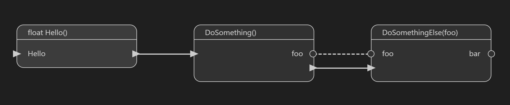
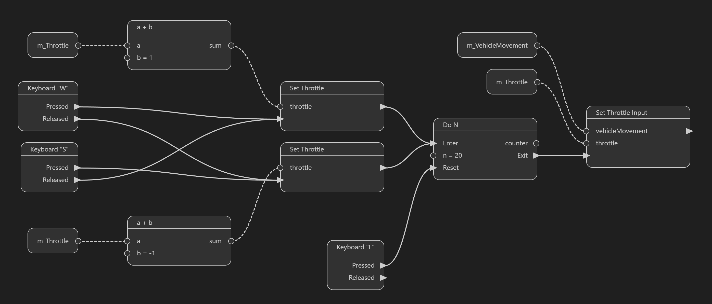
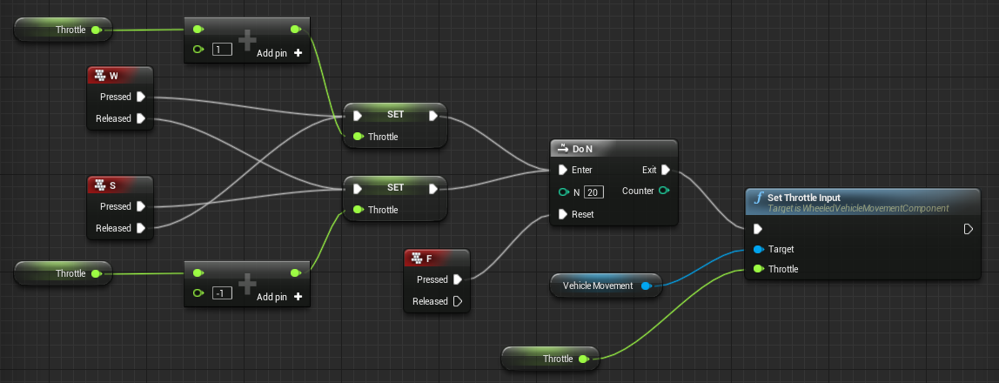

# Unstitch C++

> Command Palette > View: Reopen Editor With... > Unstitch C++ Editor

Nodal projection for C++ source code.

Basic prototype for a visual scripting tool backed by a textual data model. Nodes and connections are persisted as plain executable code. Lightweight annotations (called stitches) delimit code sections attributed to each node in the graph. The editor extracts declarations associated to each node and models references as links between nodes.

## Examples

### Hello World

```cpp
//// 1 1
float Hello()
{
    //// 2 1
    float foo = DoSomething();

    //// 3 1
    float bar = DoSomethingElse(foo);
}
```



### Blueprint Parity

[./example.cpp](./example.cpp)



[original](https://dev.epicgames.com/documentation/en-us/unreal-engine/flow-control-in-unreal-engine)


